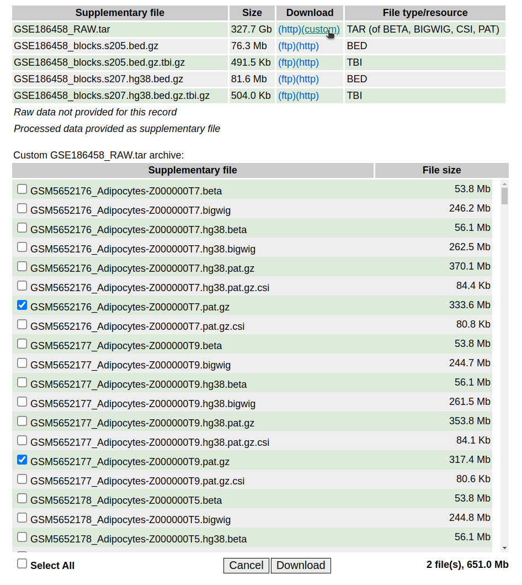

# Read simulation from the normal cell-type methylation atlas data [Loyfer et al., Nature 2023](https://doi.org/10.1038/s41586-022-05580-6).
[](https://doi.org/10.5281/zenodo.14025053)

We implemented python codes to simulate sequence reads from the normal cell-type methylation atlas data, primarily for running [**MethylBERT**](https://github.com/CompEpigen/methylbert).

## How to use
### Set-up
We provide `requirements.txt` and `Dockerfile` files for setting up the environment. Please follow the [Set-up](https://github.com/CompEpigen/methylseq_simulation?tab=readme-ov-file#set-up) section in our *methylseq_simulation* repo. 

### Data preparation
You can download `.pat` files for the normal cell-type methylation atlas [GEO page](https://www.ncbi.nlm.nih.gov/geo/query/acc.cgi?acc=GSE186458). The `custom` button allows you to select files to download. Please, note that our code currently supports only **hg19** aligned files. 



### Simulate reads from the prepared data
1. Unzip the downloaded `.pat.gz` files. `.pat` file format is required for the simulation.
2. Create a `.txt` file including a list of files you want to process. **Please, do not change the input file names!!**

  e.g., )
```
> cat input.txt 
/home/GSE186458_normal_cell_atlas/data/pat/GSM5652285_Blood-T-CenMem-CD4-Z00000417.pat
/home/GSE186458_normal_cell_atlas/data/pat/GSM5652299_Blood-NK-Z000000TM.pat
/home/GSE186458_normal_cell_atlas/data/pat/GSM5652181_Saphenous-Vein-Endothel-Z000000RM.pat
/home/GSE186458_normal_cell_atlas/data/pat/GSM5652317_Blood-B-Z000000UB.pat

```
3. **(Optional)** Select genomic regions in [Supplementary Table 4 provided by Loyfer et al.](https://static-content.springer.com/esm/art%3A10.1038%2Fs41586-022-05580-6/MediaObjects/41586_2022_5580_MOESM4_ESM.xlsx) to simulate reads, and create a (tab-deliminated) `.csv` file. In the next step, this file should be given with `-r` option. **Otherwise, the simulation automatically determines cell type-specific hypomethylated regions from the input file.**

e.g.,)
```
> cat region.csv
Type	chr	start	end	startCpG	endCpG	position	Number of CpGs	Length	Target meth. 	Background meth.	Diff	Genomic class	Gene
Adipocytes	chr1	12559496	12560014	251636	251647	chr1:12559496-12560014	11CpGs	518bp	0.231	0.914	0.683	intron	VPS13D
Adipocytes	chr7	134849833	134850163	11801018	11801023	chr7:134849833-134850163	5CpGs	330bp	0.164	0.833	0.669	TTS	C7orf49
Adipocytes	chr2	127878592	127878832	3458229	3458234	chr2:127878592-127878832	5CpGs	240bp	0.209	0.877	0.668	Intergenic	BIN1
Adipocytes	chr11	62304487	62304527	16537896	16537901	chr11:62304487-62304527	5CpGs	40bp	0.267	0.903	0.636	intron	AHNAK
```
4. Run the source code with the command line `python src/main.py [options]`.
```
python src/main.py -f input.txt -c 50 -o ./res/
```

### Example output
```
> head -n 3 test/res/GSM5652317_Blood-B-Z000000UB_reads.csv 
ref_name	ref_pos	original_seq	dna_seq	original_methyl	methyl_seq	dmr_label	dmr_ctype	ctype
chr1    8212920 GCTCATGGGTACATGGCTAGTAAACACCAGAGCTGGCTCTAGGACTCGCATTGATGTCGGTTAATTGATATACCTGACCCCGCTACTAGTGCACAATTACTGCCCTGC    GCT CTC TCA CAT ATG TGG GGG GGT GTA TAC ACA CAT ATG TGG GGC GCT CTA TAG AGT GTA TAA AAA AAC ACA CAC ACC CCA CAG AGA GAG AGC GCT CTG TGG GGC GCT CTC TCT CTA TAG AGG GGA GAC ACT CTC TCG CGC GCA CAT ATT TTG TGA GAT ATG TGT GTC TCG CGG GGT GTT TTA TAA AAT ATT TTG TGA GAT ATA TAT ATA TAC ACC CCT CTG TGA GAC ACC CCC CCC CCG CGC GCT CTA TAC ACT CTA TAG AGT GTG TGC GCA CAC ACA CAA AAT ATT TTA TAC ACT CTG TGC GCC CCC CCT CTG TGC   CCT     2222222222222222222222222222222222222222222221222222222212222222222222222222222022222222222222222222222222   531     Blood-T Blood-B
chr1	3278274	GGTGGTGAGAAGTGACTGTGACCCGGGAGCGAGGGCAGGTGGTGAGAAGTGACGCGGTCTGGGAGGGCAGGAGGTGAGAAGTGACTGC	GGT GTG TGG GGT GTG TGA GAG AGA GAA AAG AGT GTG TGA GAC ACT CTG TGT GTG TGA GAC ACC CCC CCG CGG GGG GGA GAG AGC GCG CGA GAG AGG GGG GGC GCA CAG AGG GGT GTG TGG GGT GTG TGA GAG AGA GAA AAG AGT GTG TGA GAC ACG CGC GCG CGG GGT GTC TCT CTG TGG GGG GGA GAG AGG GGG GGC GCA CAG AGG GGA GAG AGG GGT GTG TGA GAG AGA GAA AAG AGT GTG TGA GAC ACT CTG TGC	CCTCTCCC	22222222222222222222221222221222222222222222222222202122222222222222222222222222222222	493	Blood-NK	Blood-B
```


### Source code usage 
```
> python3 src/main.py --help
usage: main.py [-h] [-o OUTPUT_DIR] [-c CORES] [-r F_REGION] [-g GENOME] -f
               F_INPUT

optional arguments:
  -h, --help            show this help message and exit
  -o OUTPUT_DIR, --output_dir OUTPUT_DIR
                        Directory to save the results (default: ./)
  -c CORES, --cores CORES
                        Number of cores for multiprocessing. A larger number
                        increases the computation speed. (default: 1)
  -r F_REGION, --f_region F_REGION
                        Selected regions for training MethylBERT. If not
                        given, it automatically selects regions for the given
                        files.
  -g GENOME, --genome GENOME
                        Reference genome (either hg19 or hg38). Currently only
                        hg19 is available. (default: hg19)
  -f F_INPUT, --f_input F_INPUT
                        Text file containing a list of .pat files OR path to a
                        .pat file

```

## Citation
```
@article {Jeong2023.10.29.564590,
	author = {Jeong, Yunhee and Gerh{\"a}user, Clarissa and Sauter, Guido and Schlomm, Thorsten and Rohr, Karl and Lutsik, Pavlo},
	title = {MethylBERT: A Transformer-based model for read-level DNA methylation pattern identification and tumour deconvolution},
	elocation-id = {2023.10.29.564590},
	year = {2024},
	doi = {10.1101/2023.10.29.564590},
	publisher = {Cold Spring Harbor Laboratory},
	URL = {https://www.biorxiv.org/content/early/2024/05/22/2023.10.29.564590},
	eprint = {https://www.biorxiv.org/content/early/2024/05/22/2023.10.29.564590.full.pdf},
	journal = {bioRxiv}
}
```
